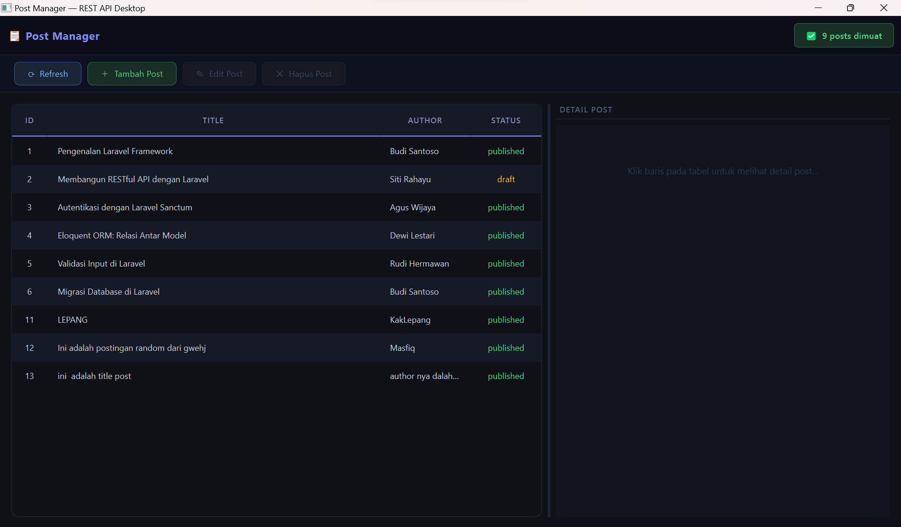
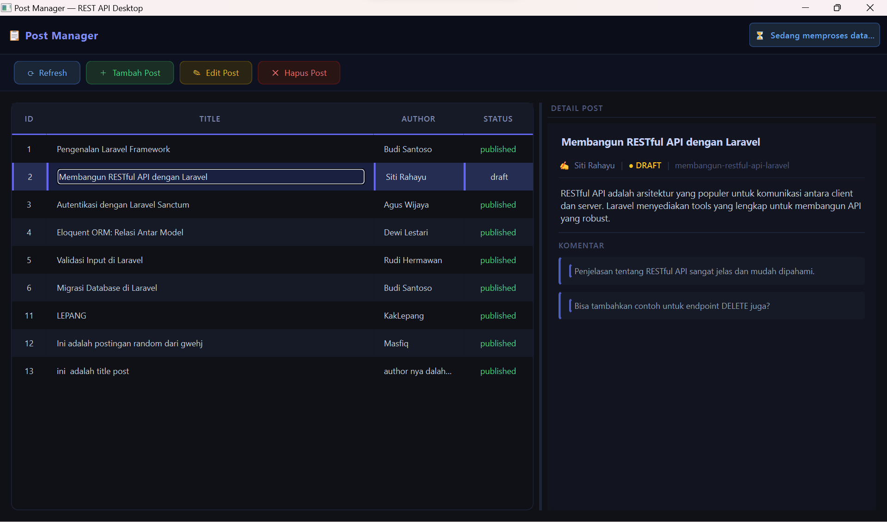
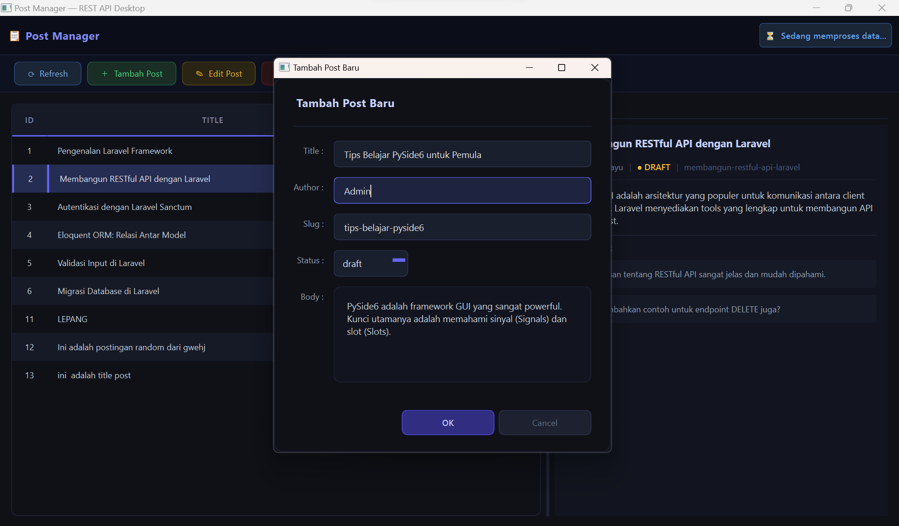
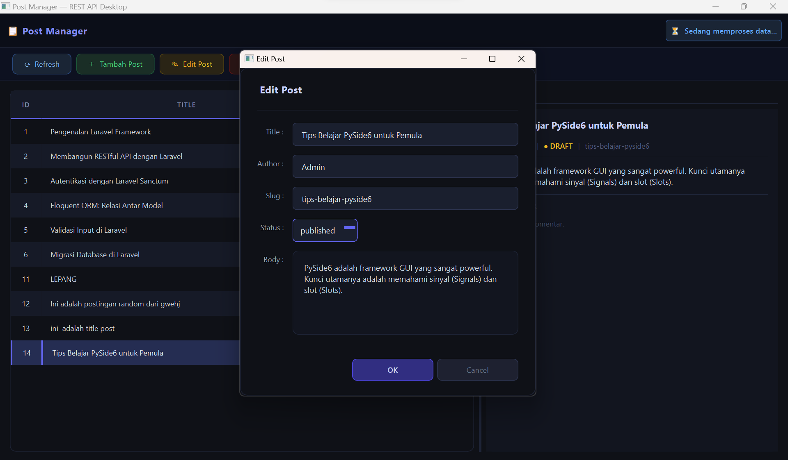
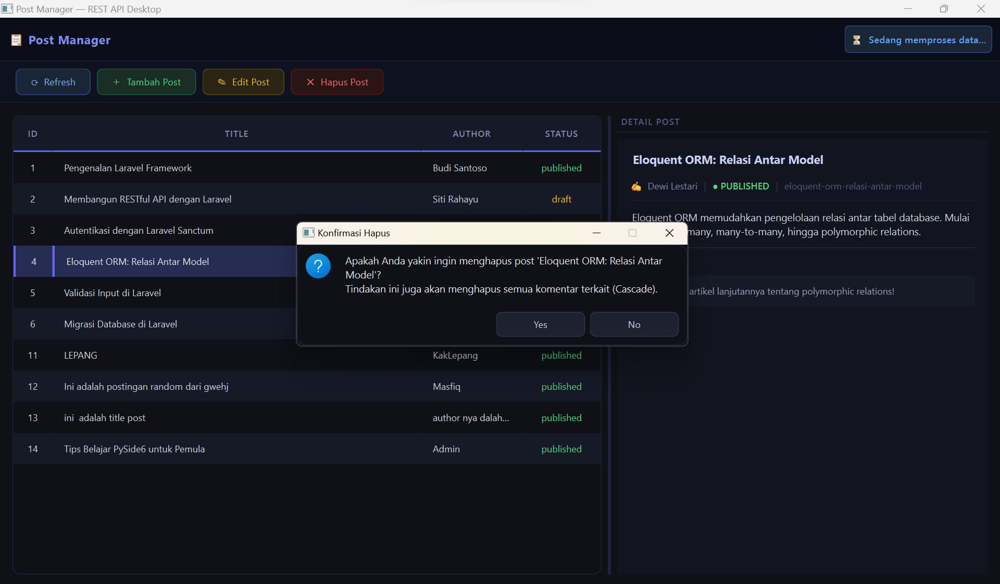
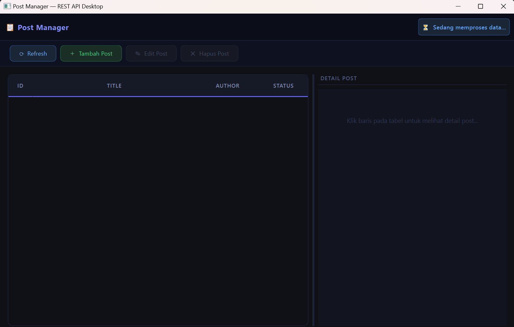
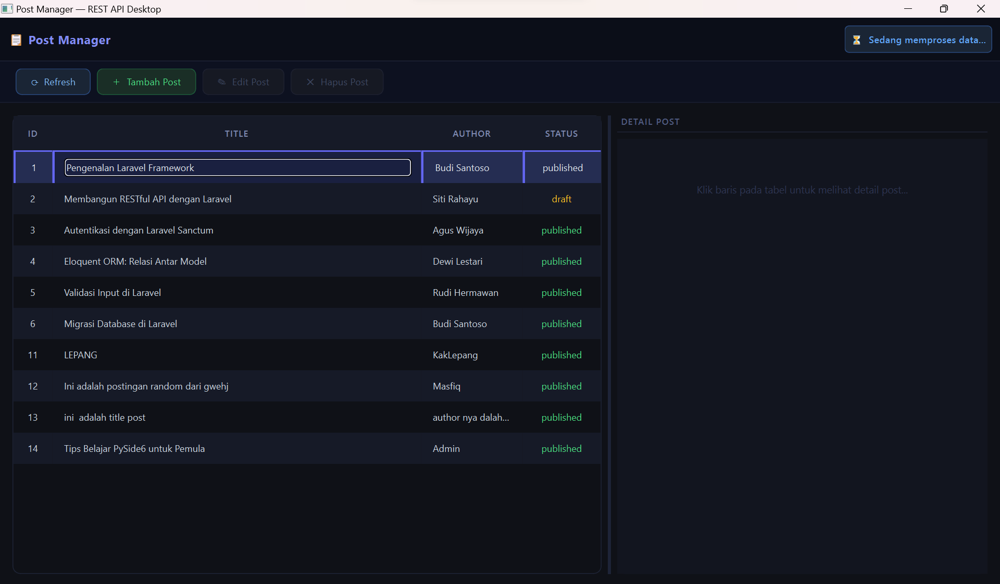

## Identitas Mahasiswa
**Nama:** Valerine Jesika Dewi  
**NIM:** F1D02310027

## Post Manager - Desktop REST API Client
Aplikasi Desktop berbasis Python menggunakan **PySide6** untuk mengelola data postingan melalui REST API. Aplikasi ini dirancang dengan prinsip *Separation of Concerns* (SoC) untuk memisahkan logika bisnis, komunikasi API, dan antarmuka pengguna.

## Struktur Proyek
- `main.py`: Entry point aplikasi dan pengatur orkestrasi logika.
- `ui_main.py` & `ui_dialog.py`: Pemisahan kode layout antarmuka agar lebih rapi.
- `dialogs.py`: Logika untuk form input data (Tambah/Edit).
- `api_worker.py`: Menangani threading untuk operasi jaringan.
- `api_service.py`: Modul khusus untuk komunikasi HTTP ke server.
- `style.qss`: Definisi gaya visual (CSS-like) untuk tema aplikasi.

## Tampilan Aplikasi
Berikut adalah cuplikan antarmuka dari aplikasi Post Manager:

*Gambar 1: Tampilan Semua Daftar Posts.*

*Gambar 2: Tampilan Detail Sebuah Post.*

*Gambar 3: Tampilan Form Tambah Post.*

*Gambar 4: Tampilan Form Edit Post.*

*Gambar 5: Tampilan Hapus Post.*

*Gambar 6: Tampilan Status Loading Saat Request Berjalan.*

